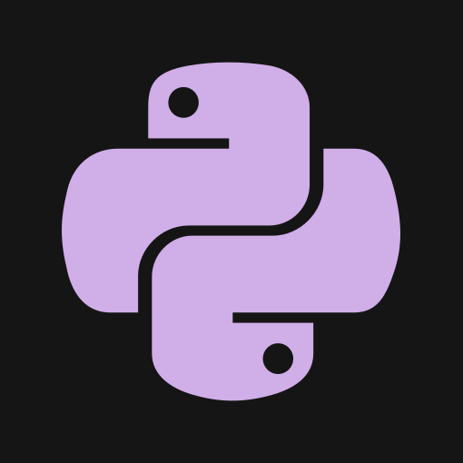
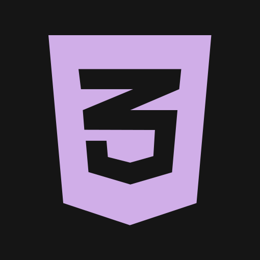
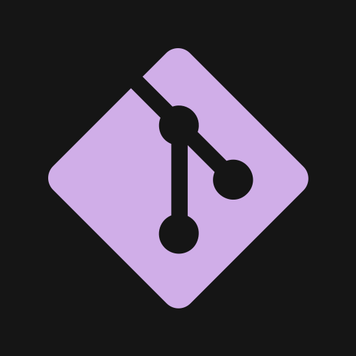
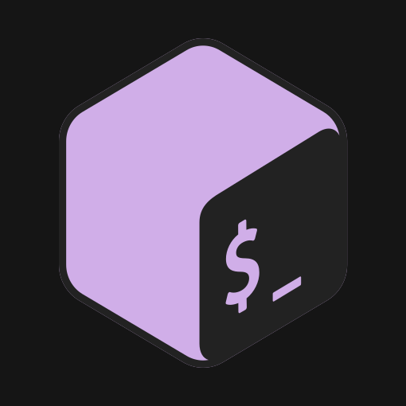

 

 

      

<h1 align="center">tardiobscurus :white_heart: github</h1>

hello! this is the official GitHub of the japanese music curator, programming loving weeb, [tardiobscurus](https://youtube.com/c/tardiobscurus). currently, a high school senior, taking an interest in web design, cybersecurity, and AI, sharing the world over his projects and simple practice programs to improve their skills.

🌱 currently learning: react js

🔨 currently working on: ... 

<h2 align="center">languages and tools</h2>  

      

<h2 align="center">my work</h2>

the work i've done recently. the recent project as of now is my [unCAPTCHA](https://github.com/tardiobscurus/unCAPTCHA) repo.

<h3 align="center">websites</h3>

  

<h3 align="center">python programs</h3>

 

    
<h2 align="center">stats on my page</h2>

 

<!-- 

 -->
